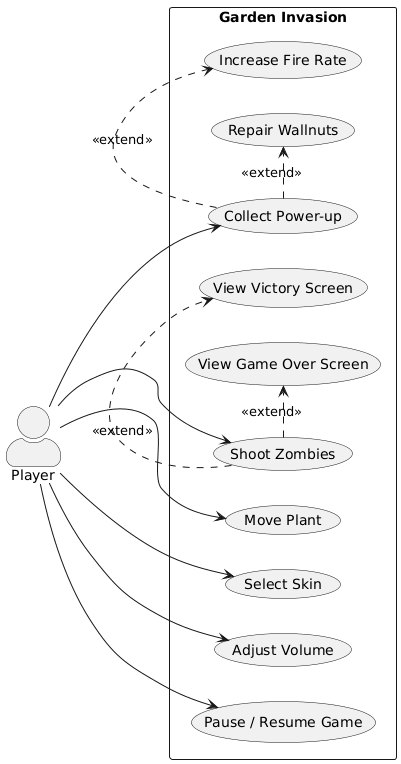

# Requirements

## User Stories

**Persona: Casual Player**
> A player who wants a fun arcade session on their PC.

- As a player, I want to move my plant left and right so that I can dodge incoming zombie projectiles.
- As a player, I want my plant to shoot automatically so that I can focus on movement and strategy.
- As a player, I want to see my remaining life points so that I know how close I am to losing.
- As a player, I want wallnuts placed in front of me so that they absorb damage and protect me.
- As a player, I want to collect power-ups dropped by defeated zombies so that I can gain a temporary advantage.
- As a player, I want to choose my plant skin before the game so that I can personalise my experience.
- As a player, I want to adjust the volume so that I can control audio to my preference.
- As a player, I want to pause the game so that I can take a break without losing progress.
- As a player, I want to see a victory screen when I survive all waves so that I feel rewarded.
- As a player, I want to see a game over screen when I die so that I can restart or return to the menu easily.

*Figure 1 — Garden Invasion use case diagram*

---

## Requirements Analysis

### Functional Requirements

| ID   | Requirement | Acceptance Criteria |
|------|-------------|---------------------|
| F01  | The player can move the plant left and right within screen bounds | Plant does not go outside left or right screen edge |
| F02  | The plant shoots projectiles automatically at a fixed rate | Projectiles are fired at regular intervals without user input |
| F03  | Zombies spawn in waves of increasing difficulty | Each wave contains more or faster zombies than the previous |
| F04  | Projectiles from the player damage and can destroy zombies | Zombie health decreases on hit; zombie is removed at 0 health |
| F05  | Zombie projectiles and zombie contact damage the plant | Plant life points decrease; game over when life points reach 0 |
| F06  | Wallnuts absorb damage from zombie projectiles and zombie contact | Wallnut health decreases on hit; wallnut is removed at 0 health |
| F07  | Defeated zombies drop power-ups with 90% probability | A collectible sprite appears at the zombie's death position |
| F08  | IncreasingFirePU temporarily reduces plant shoot cooldown by 40% | shoot_SecondTime drops to 60% of base for 5 seconds after collection |
| F09  | RepairWallnutPU restores all wallnuts to full health and respawns destroyed ones | All 4 wallnut slots are occupied and show full-health sprite after collection |
| F10  | The player can select a skin before the game starts | Selected skin persists into gameplay and correct sprite is shown |
| F11  | The player can adjust music and sound effect volume | Audio plays at the configured volume level |
| F12  | The player can pause and resume the game | Game state is frozen on pause and correctly resumes |
| F13  | A victory screen is shown when all waves are cleared | Victory screen appears after last zombie is defeated with no pending spawns |
| F14  | A game over screen is shown when the plant is destroyed | Game over screen appears immediately when plant life reaches 0 |

### Non-Functional Requirements

| ID   | Requirement | Acceptance Criteria |
|------|-------------|---------------------|
| NF01 | The game must run at a stable 60 FPS on standard hardware | Frame rate stays at or near 60 FPS during normal gameplay |
| NF02 | Controls must be responsive with no perceptible input lag | Player movement and shooting respond within one frame |
| NF03 | The codebase must follow MVC separation of concerns | No rendering logic in Model files; no game logic in View files |
| NF04 | The game must be runnable on Windows, macOS, and Linux | Game launches and plays correctly on all three platforms |
| NF05 | Test coverage must cover all core model and controller logic | All priority test cases pass in CI without failures |

### Implementation Requirements

| ID  | Requirement | Justification | Acceptance Criteria |
|-----|-------------|---------------|---------------------|
| I01 | The project must be implemented in **Python 3** | Course requirement (Software Engineering @ DTM/UniBo) | The project runs with `python3` and no Python 2 syntax is present |
| I02 | **Pygame** must be used as the game and rendering library | Course requirement; provides sprite, event, and collision primitives needed | All rendering, input handling, and collision detection use Pygame APIs exclusively |
| I03 | The project must follow the **MVC** architectural pattern | Course requirement to demonstrate software design principles | Model files contain no rendering calls; View files contain no game logic; Controller files mediate between the two |
| I04 | **unittest** must be used for automated testing | Course requirement; standard Python testing framework | All tests are written using `unittest.TestCase` and pass via `python -m pytest` or `python -m unittest` |
| I05 | The project must use **semantic versioning** and **conventional commits** | Course CI/CD pipeline is configured around these conventions | All commit messages follow the `type: description` format; version is automatically bumped by semantic-release on merge to master |
| I06 | The project must be **installable as a Python package** | Enables distribution via PyPI and consistent dependency management | Running `pip install .` installs the package without errors; the game can be launched after installation |
| I07 | A **CI/CD pipeline** must automatically run tests and publish releases | Course requirement to demonstrate DevOps practices | GitHub Actions runs all tests on every push; a passing build on master triggers a semantic-release version bump and PyPI upload |

---

## Glossary

| Term | Definition |
|------|------------|
| **Plant** | The player-controlled sprite that moves and shoots |
| **Wallnut** | A defensive sprite placed in front of the plant that absorbs damage |
| **Wave** | A timed group of zombies spawned progressively during gameplay |
| **Power-up** | A collectible sprite dropped by a defeated zombie that grants a temporary effect |
| **IncreasingFirePU** | Power-up that reduces the plant's shoot cooldown for 5 seconds |
| **RepairWallnutPU** | Power-up that restores all wallnuts to full health and respawns destroyed ones |
| **Shoot cooldown** | The minimum time (ms) that must pass between two consecutive shots |
| **Life points** | Integer counter representing remaining health for the plant or a wallnut |
| **Skin** | A visual variant of the player sprite (Classic, Cactus, Carnivorous Plant) |
