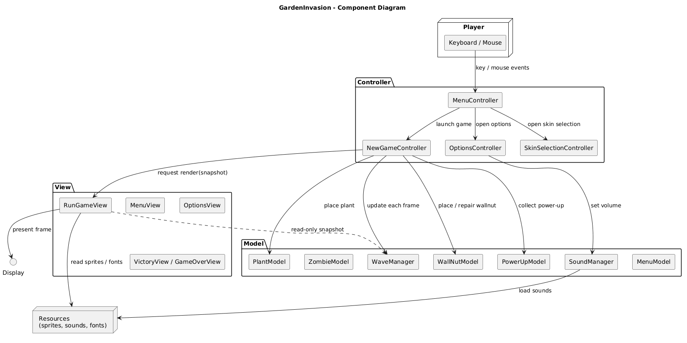
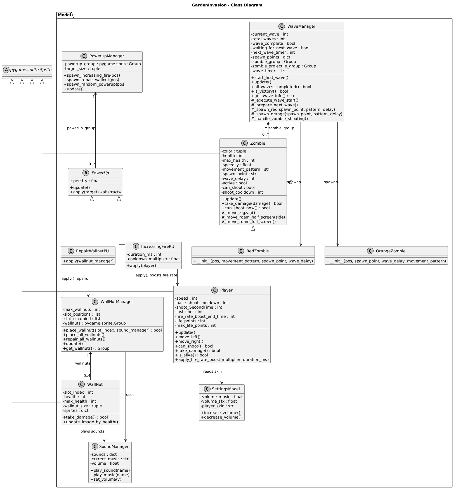
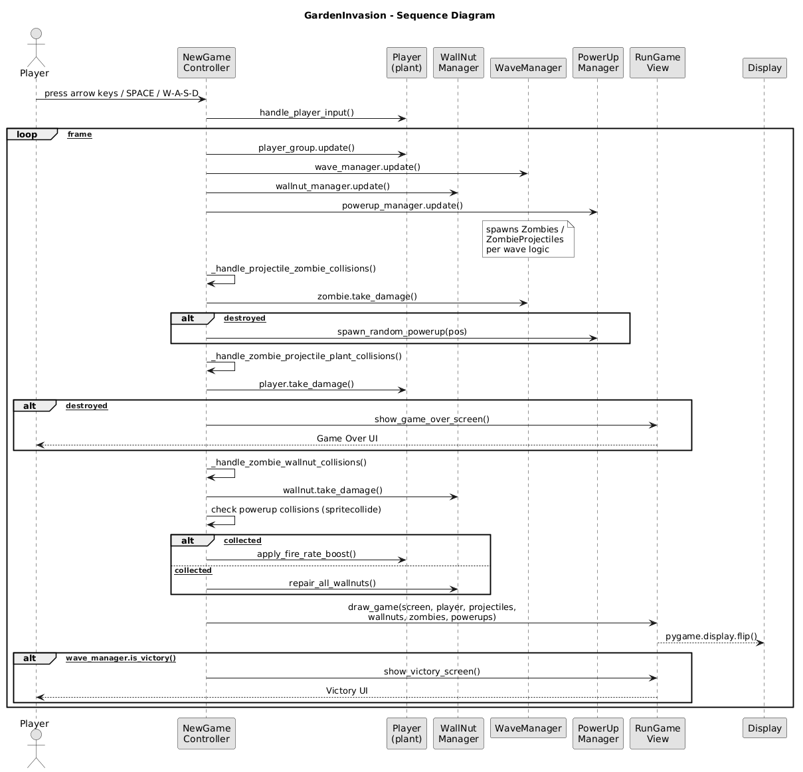
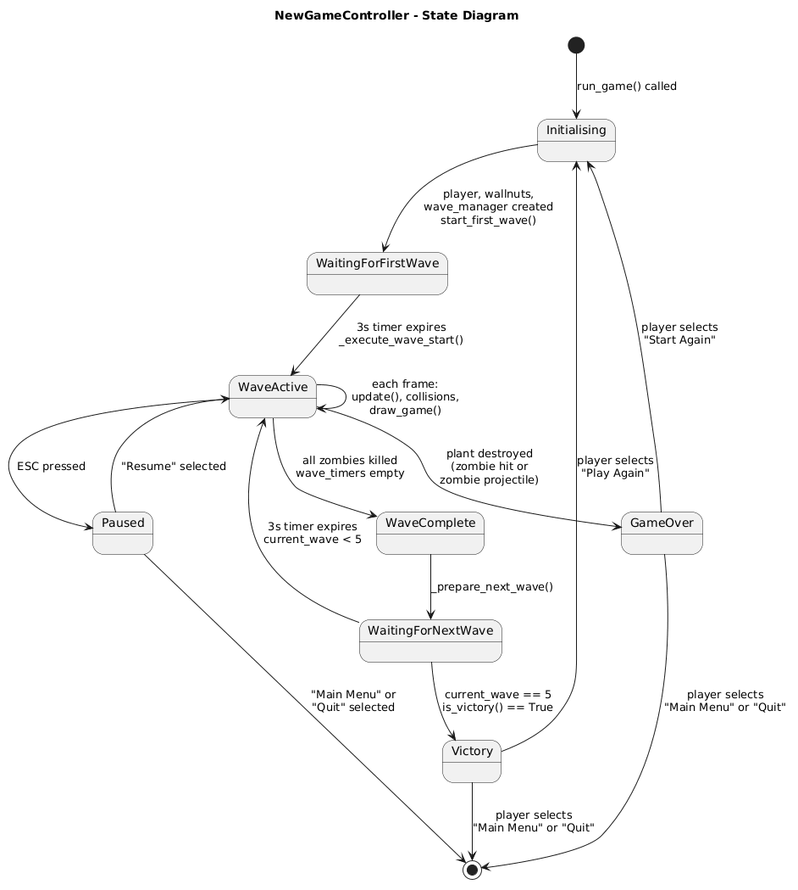
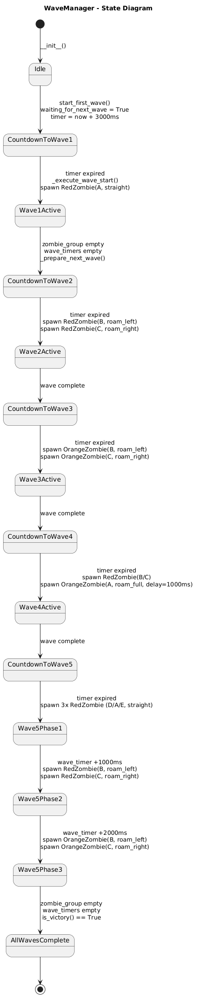
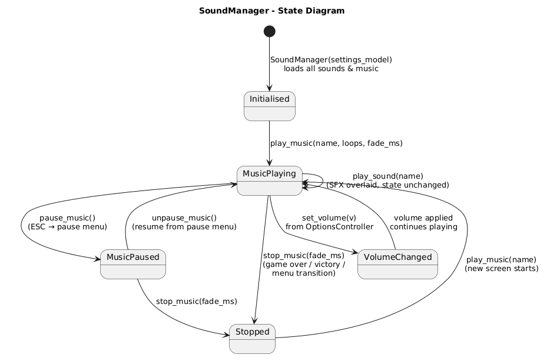

# Design

This chapter explains the strategies used to meet the requirements identified in the analysis.  Ideally, the design should be the same, regardless of the technological choices made during the implementation phase.

## Architecture 

Garden Invasion adopts a **layered architectural style**, specifically the **MVC (Model-View-Controller)** pattern. This choice separates concerns cleanly: the Model holds game state and logic, the View handles rendering, and the Controller mediates user input and orchestrates updates. Event-based or shared dataspace architectures were not considered appropriate, as the game has no distributed components and all state is local to a single process.

The physical structure of the codebase reflects this directly — the source tree is split into three top-level packages under `GardenInvasion/`:

**Responsibilities of each layer:**

- **Model** -> holds and mutates all game state. Each domain entity has its own model class (e.g. `PlantModel`, `ZombieModel`, `WaveManager`, `PowerUpModel`). Models are unaware of rendering or input.
- **View** -> each entity has a corresponding view class (e.g. `PlantView`, `ZombieView`, `MenuView`) responsible only for drawing to the pygame surface. Views read from Models but never modify them.
- **Controller** -> orchestrates the game loop, processes pygame events, and coordinates Model updates and View redraws. The main entry point is `NewGame_controller.py`, with dedicated controllers for each screen (`MenuController`, `OptionsController`, `SkinSelectionController`, etc.).
- **Utilities** -> shared constants (`constants.py`) such as `SCREEN_WIDTH`, `SCREEN_HEIGHT`, and spawn coordinates, used across all layers to avoid magic numbers.

## Infrastructure (mostly applies to distributed systems)

Garden Invasion is a **single-player local desktop game** with no distributed infrastructure. There are no servers, databases, message brokers, load balancers, or network components of any kind. The entire system runs as a single Python process on the player's machine, launched via `python -m GardenInvasion`. The only external dependency is `pygame`, which handles windowing, input events, and audio via the local OS.

## Modelling

### Domain driven design (DDD) modelling

The domain has a single bounded context: **the Game Session**. Within it, the key domain concepts are:

- **Entities** (have identity and lifecycle): `Plant`, `Zombie`, `WallNut`, `Projectile`, `ZombieProjectile`, `PowerUp`, `WaveManager`, `Player`
- **Value Objects** (no identity, defined by attributes): spawn coordinates (points A–E), volume settings, skin selection
- **Aggregates**: `WaveManager` is the main aggregate root for the game session — it owns `zombie_group`, `zombie_projectile_group`, and `wave_timers`, and exposes `is_victory()` and `all_waves_completed()`
- **Services**: `SoundManager` acts as a domain service managing background music and sound effects independently of any single entity
- **Domain Events** (implicit, via pygame): `WAVE_STARTED`, `ZOMBIE_KILLED`, `PLANT_PLACED`, `POWERUP_COLLECTED`, `GAME_OVER`, `VICTORY`

There are no explicit repositories or factories, as the game does not persist state to storage — all game objects are created in-memory by controllers during the game session.

### Object-oriented modelling

The main classes and their key responsibilities are:

| Class | Layer | Key Attributes | Key Methods |
|---|---|---|---|
| `PlantModel` | Model | `health`, `fire_rate`, `damage`, `rect` | `shoot()`, `take_damage()`, `update()` |
| `ZombieModel` | Model | `health`, `speed`, `movement_type`, `rect` | `move()`, `take_damage()`, `update()` |
| `WallNutModel` | Model | `health`, `max_health`, `rect` | `take_damage()`, `repair()`, `update()` |
| `ProjectileModel` | Model | `speed`, `damage`, `rect` | `update()` |
| `ZombieProjectileModel` | Model | `speed`, `damage`, `rect` | `update()` |
| `PowerUpModel` | Model | `type` (`fire_rate`/`repair`), `rect`, `speed` | `update()`, `apply()` |
| `WaveManager` | Model | `current_wave`, `total_waves`, `zombie_group`, `wave_timers` | `start_first_wave()`, `update()`, `is_victory()`, `all_waves_completed()` |
| `SoundManager` | Model | `sounds`, `current_music`, `volume` | `play_sound()`, `play_music()`, `set_volume()` |
| `MenuModel` | Model | `options`, `selected_index` | `select_next()`, `select_previous()`, `get_selected_option()` |
| `SkinSelectionModel` | Model | `skins`, `selected_skin` | `next_skin()`, `previous_skin()`, `confirm()` |
| `VictoryModel` | Model | `options`, `selected_index` | `select_next()`, `select_previous()`, `get_selected_option()` |
| `SettingsModel` | Model | `volume_music`, `volume_sfx` | `increase_volume()`, `decrease_volume()` |
| `NewGameController` | Controller | `wave_manager`, `plant_group`, `player`, `screen` | `run()`, `handle_events()`, `update()`, `draw()` |
| `MenuController` | Controller | `menu_model`, `menu_view`, `sound_manager` | `run()`, `handle_events()` |

Relationships:
- `NewGameController` **owns** `WaveManager`, `PlantGroup`, `WallNutGroup`, and `Player` — it is the central coordinator of the game session.
- `WaveManager` **owns** `zombie_group` and `zombie_projectile_group` (sprite groups managed by pygame).
- Each View class holds a reference to its corresponding Model(s) and a `pygame.Surface` for rendering.
- `SoundManager` is shared across controllers (passed by reference) to maintain consistent audio state across screens.

## Interaction

All interaction in Garden Invasion is **event-driven**, mediated by pygame's event loop. Each controller runs a `while running:` loop that:

1. Polls `pygame.event.get()` for keyboard and mouse events
2. Passes relevant events to the Model (state update)
3. Calls `view.draw()` to re-render the screen
4. Calls `pygame.display.flip()` to commit the frame

Screen transitions follow a **chain-of-responsibility** pattern: when a controller finishes (e.g. the menu selection triggers "New Game"), it returns a signal string (e.g. `"new_game"`, `"options"`, `"quit"`) to `__main__.py`, which then instantiates the next controller.

## Behaviour

### NewGameController (stateful — central game loop)

The game session has the following main states:

- **Waiting for first wave** — `start_first_wave()` sets a timer before the first zombie spawns
- **Wave active** — zombies are alive; plants shoot; player can place plants/wallnuts
- **Wave complete** — all zombies killed; brief pause before next wave begins
- **Game Over** — a zombie has reached the left edge of the screen; transitions to `GameOverController`
- **Victory** — all 5 waves cleared with no zombies remaining; transitions to `VictoryController`

`PowerUp` objects enter the game when a zombie is killed — they fall from the zombie's death position. If the player (sprite) collides with a `PowerUp`, `NewGameController` applies its effect: either boosting plant fire rate (`fire_rate` type) or repairing the WallNut (`repair` type).

### WaveManager (stateful)

Manages 5 waves with increasing difficulty:
- Wave 1: 1 straight zombie
- Wave 2: 2 zigzag zombies
- Wave 3: 2 stronger zombies (health = 2)
- Wave 4: 3 zigzag zombies
- Wave 5: multi-phase (3 straight + 2 zigzag + 2 strong), spawned with timed delays via `wave_timers`

### SoundManager (stateful)

Tracks currently playing background music and applies volume settings from `SettingsModel`. It is initialized once and passed to all controllers, ensuring volume changes in the Options screen persist throughout the session.

## Data-related aspects

Garden Invasion does **not use persistent storage**. All game state (wave progress, plant positions, zombie health, score) exists only in memory during a session and is discarded when the game closes.

The only quasi-persistent data is **volume settings**, stored in `SettingsModel` in memory during the session. There is no file I/O, database, or serialization layer. If persistence of settings or high scores were desired in the future, a simple key-value file (e.g. JSON or INI) on the local filesystem would be sufficient, written and read by `SettingsModel` on startup and shutdown.

